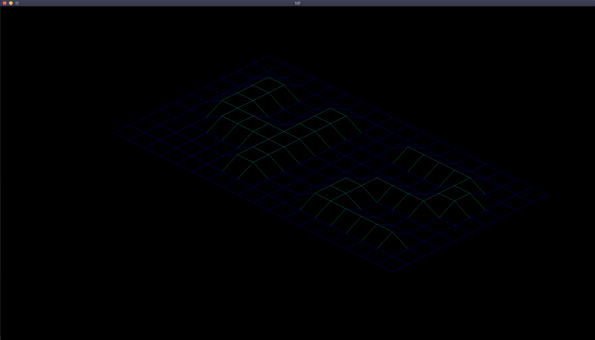
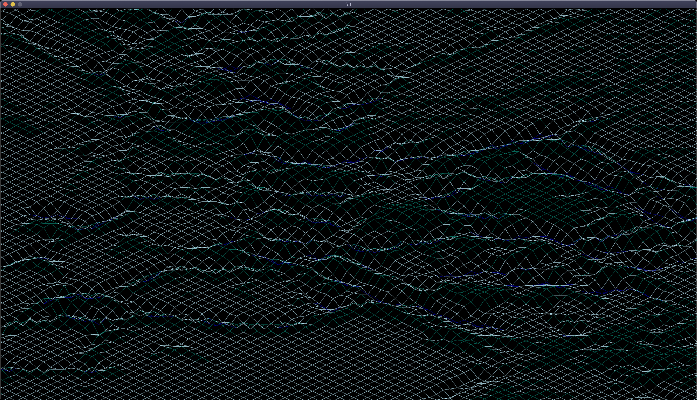
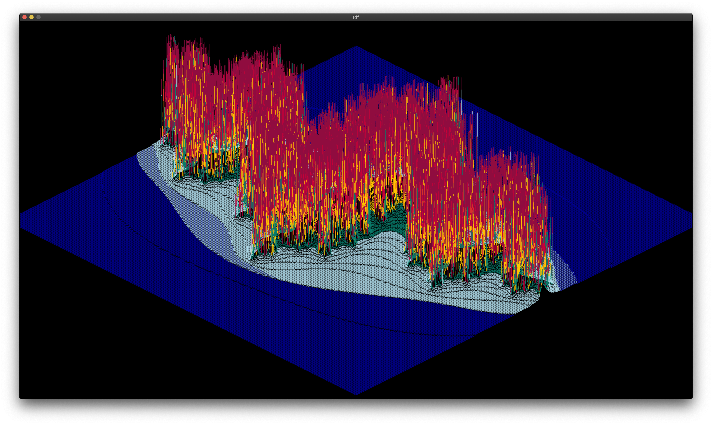

# FdF - A Wireframe Model Generator

*This project was developed as part of the Ecole 42 curriculum.*

## Overview

`fd` is a project at Ecole 42


## Description

The `fdf` project is a challenging graphics programming exercise. The main lessons learned from the projects:

- **Graphics Programming in C**: aaaaa
- **Graphics Programming in C**: bbbbb


## Screenshots





## Prerequisites

To run `fdf`, you are going to need the `Minilibx` library.

This is included with the project and set to use that by default. Don't mind the errors!

If you are a 42 student and wish to run this via the internal MLX, please update the Makefile and fdf.h accordingly.

## Installation

```bash
git clone https://github.com/tikanoja/FdF fdf && cd fdf && make
```

Do not mind the errors, the MLX library is just very verbose heh!

## Usage

Cd to the installation location and execute with the path to the .fdf file as an argument.

```bash
./fdf test_maps/t2.fdf
```

## Helpful Resources


